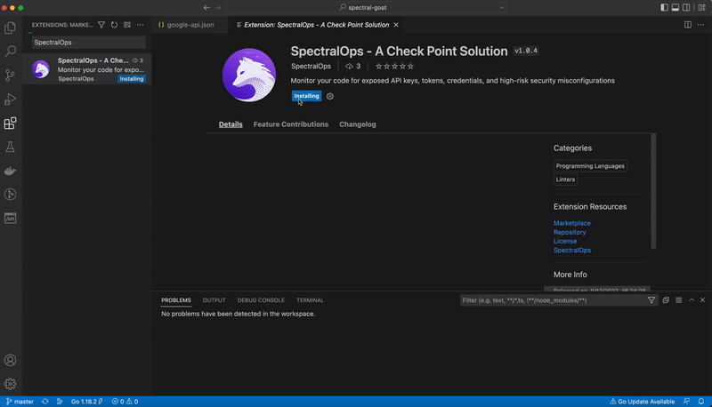

     
     
    

    
    

    

        
        
    

# Spectral VS Code extension

The Spectral VS Code extension is a tool for developers that want to catch security issues (such as credentials, tokens and IaC misconfigurations) while still coding.

    

## What is Spectral?

Monitor, classify, and protect your code, assets, and infrastructure for exposed API keys, tokens, credentials, and high-risk IaC security misconfigurations simply, without noise. Spectral comes with an industry's leading detector coverage with over 2500 different detectors built-in, including machine learning based detectors.

What this means in the context of a developer, working in VS Code, is that while you write your code, we're actively scanning it to make sure you don't accidentally enter sensitive data, which can be used against you if breached.

Spectral scans your code locally, sending only metadata back to our servers. No actual data (like credentials or tokens we may find) is transmitted outside your computer. This ensures we're never going to be a part of a supply-chain attack.

Read more about our mission statement [here](https://spectralops.io/).

## Install the extension

After you've installed the extension, you'll see a new icon in the activity bar.

First, you'll now need to download Spectral binary. Additionally, you'll need to fill in your Spectral DSN. The extension will guide you through those steps - read on to learn more.

## Configuration

- Sign up and get your SpectralOps account [here.](https://get.spectralops.io/signup) If you already have an account, sign in and do the next step.
- From Settings -> Organization, copy your DSN.
- In Visual Studio Code, set your DSN in the SpectralOps extension.

## Usage

- Open a workspace you wish to scan with the SpectralOps extension.
- Click Scan now 
- Scan results should appear in the SpectralOps extension and your editor.

#### Spectral DSN

The Spectral DSN (Data Source Name) is your personal key to communicate with Spectral. While the extension does not transmit data to our servers, you still need a DSN for Spectral to operate.

#### Spectral binary

This extension requires the Spectral binary to be present and available. You can install it  from the extension or by following the instructions in our docs.

### How to Contribute

We welcome [issues](https://github.com/SpectralOps/vscode-extension/issues) to and [pull requests](https://github.com/SpectralOps/vscode-extension/pulls) against this repository!

## License

This project is licensed under the MIT License. See [LICENSE](LICENSE) for further details.

